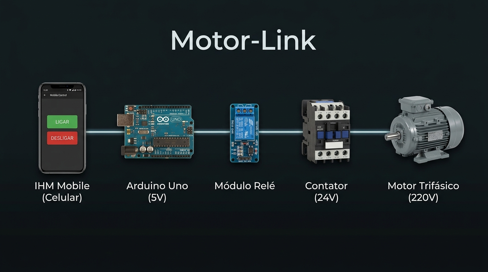
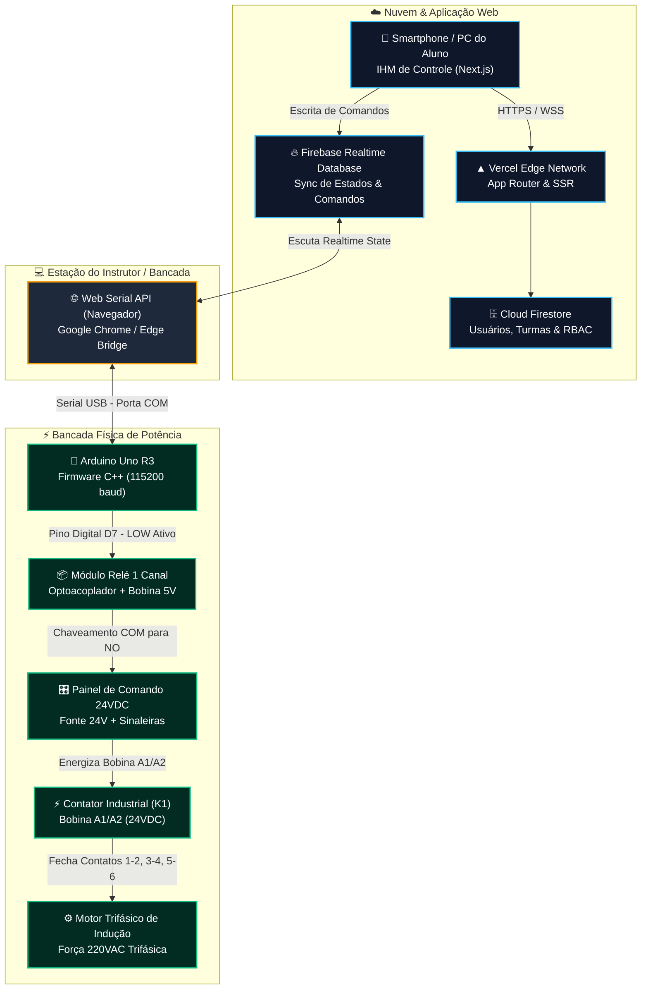
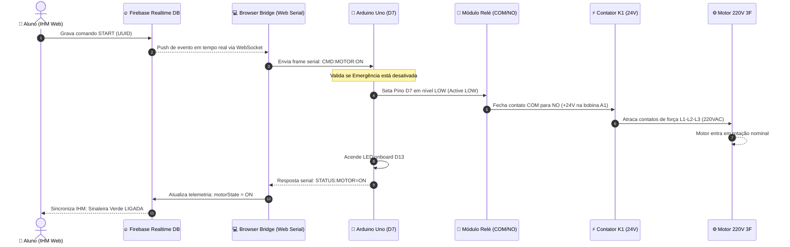
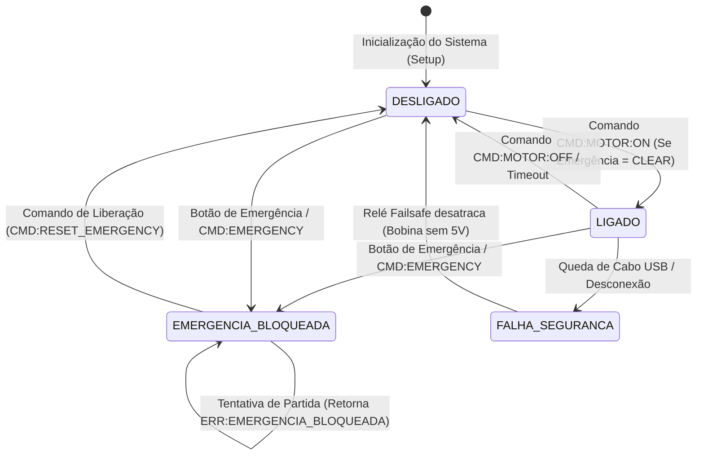

# Motor-Link ⚡📱🏭

<div align="center">



### **Plataforma Educacional Integrada de Acionamento Elétrico de Potência, Supervisão Didática e IoT Industrial**
*Unidade Curricular de Eletrônica de Potência e Comandos Elétricos — SENAI*

[](https://nextjs.org/)
[](https://react.dev/)
[](https://www.typescriptlang.org/)
[](https://tailwindcss.com/)
[](https://firebase.google.com/)
[](https://www.arduino.cc/)
[](https://developer.mozilla.org/en-US/docs/Web/API/Web_Serial_API)
[](https://vercel.com/)
[](LICENSE)
[](https://www.sp.senai.br/)

<p align="center">
  <a href="#-sobre-o-projeto">Sobre</a> •
  <a href="#-principais-recursos">Recursos</a> •
  <a href="#-arquitetura-do-sistema">Arquitetura</a> •
  <a href="#-fluxo-de-execu%C3%A7%C3%A3o-e-sequ%C3%AAncia">Fluxo de Execução</a> •
  <a href="#-esquema-el%C3%A9trico--hardware">Esquema Elétrico</a> •
  <a href="#-protocolo-de-comunica%C3%A7%C3%A3o-serial">Protocolo Serial</a> •
  <a href="#-telas-e-m%C3%B3dulos-do-sistema">Módulos da IHM</a> •
  <a href="#-guia-de-instala%C3%A7%C3%A3o-e-execu%C3%A7%C3%A3o">Como Executar</a> •
  <a href="#-seguran%C3%A7a-industrial-nr-10--nr-12">Segurança</a> •
  <a href="#-licen%C3%A7a">Licença</a>
</p>

</div>

---

## 🎯 Sobre o Projeto

O **Motor-Link** é um ecossistema educacional de **Indústria 4.0** e **Eletrônica de Potência** desenvolvido para modernizar o ensino técnico e de engenharia nos laboratórios do **SENAI**. 

A solução resolve uma das maiores limitações das bancadas tradicionais: o distanciamento entre a eletrônica digital em nuvem e a força eletrotécnica pesada. Através do **Motor-Link**, qualquer smartphone ou computador se transforma instantaneamente em uma **IHM (Interface Homem-Máquina) Industrial Inteligente**, permitindo a estudantes acionar, supervisionar e compreender a fundo o chaveamento de **motores trifásicos de indução (MIT)** em 220VAC a partir de comandos em 24VDC e níveis lógicos de 5V.

### 💡 Grande Inovação: Zero Instalação de Softwares Locais
Graças à moderna **Web Serial API nativa** integrada diretamente ao navegador Google Chrome / Microsoft Edge, o professor conecta a bancada física via porta USB do computador sem a necessidade de instalar daemons, drivers adicionais ou servidores locais. A aplicação web na **Vercel** comunica-se bidirecionalmente em tempo real com o **Firebase** e despacha comandos ao **Arduino Uno** em milissegundos.

---

## 🌟 Principais Recursos

- 📱 **IHM Mobile Responsiva (Aluno):** Botoeira industrial completa com botões de *Partida*, *Parada*, sinaleiras em tempo real e *Cogumelo de Emergência* com bloqueio estrito.
- ⚡ **Simulador Didático Interativo:** Módulo animado com representação do fluxo de elétrons, destacando a passagem entre o nível lógico (5V), isolação óptica do relé, comando industrial (24V) e força trifásica (220V).
- 🔌 **Ponte Web Serial Nativa:** Conexão direta com a porta `COMx` do Arduino Uno com seletor no navegador, terminal de telemetria ao vivo e reconexão inteligente.
- 🛡️ **Segurança Failsafe (NR-10 & NR-12):** Proteção por contato NA (Normalmente Aberto), intertravamento lógico, parada de emergência prioritária e bloqueio contra religamento acidental.
- 🏫 **Painel do Instrutor & Multi-Bancadas:** Gestão de turmas, monitoramento consolidado de até 12 bancadas simultâneas e botão de desenergização global (*Global Emergency Stop*).
- 📖 **Trilha de Aprendizagem Teórica:** Explicações fundamentadas sobre relés eletromecânicos, contatores (bobina, contatos principais e auxiliares), optoacopladores, diodo flyback e segurança industrial.

---

## 🏗️ Arquitetura do Sistema

A topologia de comunicação foi projetada para garantir **baixa latência**, **alta confiabilidade** e **isolamento físico completo** entre as tensões digitais e de potência:



---

## 🔄 Fluxo de Execução e Sequência

A cadeia temporal abaixo ilustra o ciclo de vida completo de um comando de acionamento desde o clique do aluno até o giro do motor, com confirmação de status em malha fechada:



---

## ⚡ Diagrama de Estados & Segurança Failsafe

O firmware embarcado opera uma máquina de estados estrita com foco em **proteção à vida e ao maquinário**:



---

## 🔌 Esquema Elétrico & Hardware

O isolamento é dividido em **três barreiras galvânicas independentes**, impedindo que qualquer transiente de alta tensão atinja a estação de controle:

```
[BARREIRA 1: USB / 5V]          [BARREIRA 2: 24VDC]            [BARREIRA 3: 220VAC 3~]
======================          ===================            =======================
Arduino Uno (5V/GND)            Fonte Industrial 24V           Rede Trifásica 220V
      │                              │                               │ (L1, L2, L3)
   [Pino D7]                         │ (+24V)                        ▼
      ▼                              ▼                          ┌───────────┐
┌───────────┐                  ┌───────────┐                    │ Disjuntor │
│  Módulo   │ ──(Isol. Óptica)─│  Contatos │                    │  Motor    │
│   Relé    │                  │  COM / NO │                    └─────┬─────┘
└───────────┘                  └─────┬─────┘                          │
                                     │                                ▼
                                     ▼                          ┌───────────┐
                               ┌───────────┐                    │ Contator  │
                               │ Bobina A1 │ ──(Acopl. Magn.)───│ K1 (Faca) │
                               │  do K1    │                    └─────┬─────┘
                               └─────┬─────┘                          │
                                     │                                ▼
                                    0V (Fonte 24V)              ┌───────────┐
                                                                │   Motor   │
                                                                │ Trifásico │
                                                                └───────────┘
```

### 1. Arduino Uno ➔ Módulo Relé de 1 Canal
| Terminal Relé | Conexão Arduino | Função |
| :--- | :--- | :--- |
| **VCC** | **5V** | Alimentação do circuito de disparo e bobina do relé |
| **GND** | **GND** | Referência de 0V comum com o microcontrolador |
| **IN** | **Pino Digital D7** | Sinal de controle digital (Active LOW: 0V liga, 5V desliga) |
| *LED 13* | *Onboard* | Espelho de sinalização para bancadas sem lâmpadas físicas |

### 2. Módulo Relé ➔ Circuito de Comando 24VDC
| Borne Relé | Conexão Painel 24V | Função |
| :--- | :--- | :--- |
| **COM (Comum)** | **+24VDC** da fonte de comando | Barramento positivo de potência de comando |
| **NO (Normalmente Aberto)** | **Terminal A1 do Contator K1** | Condutor de chaveamento do contator e sinaleiro Verde |
| **NC (Normalmente Fechado)** | *Sinaleiro Vermelho (Opcional)* | Indicação visual de circuito desarmado / pronto |
| **Terminal A2 do K1** | **0V (GND) da fonte de 24V** | Retorno da bobina de campo do contator |

---

## 📡 Protocolo de Comunicação Serial

A comunicação serial opera a **115.200 bps**, com frames em texto ASCII terminados em `\n` ou `\r\n`:

| Direção | Mensagem / Comando | Ação no Firmware | Resposta Serial |
| :---: | :--- | :--- | :--- |
| **PC ➔ Arduino** | `CMD:MOTOR:ON` ou `ON` | Comuta pino D7 para nível baixo, atracando o relé | `STATUS:MOTOR=ON` |
| **PC ➔ Arduino** | `CMD:MOTOR:OFF` ou `OFF` | Comuta pino D7 para nível alto, desatracando o relé | `STATUS:MOTOR=OFF` |
| **PC ➔ Arduino** | `CMD:EMERGENCY` ou `STOP` | Desliga o motor **instantaneamente** e ativa trava de erro | `ALERT:EMERGENCY_ACTIVATED` |
| **PC ➔ Arduino** | `CMD:RESET_EMERGENCY` ou `RESET` | Destrava a lógica após inspeção de segurança | `INFO:EMERGENCY_RESET` |
| **PC ➔ Arduino** | `CMD:STATUS` ou `STATUS` | Requisita a telemetria instantânea da bancada | `STATUS:MOTOR=...,EMERGENCY=...,UPTIME=...` |
| **PC ➔ Arduino** | `PING` | Teste de conectividade / Heartbeat | `PONG` |
| **Arduino ➔ PC** | *(Inicialização / Boot)* | Inicializa pinos em modo seguro e envia banner | `EVENT:SYSTEM_READY` |

---

## 📱 Telas e Módulos do Sistema

| Módulo | Rota | Descrição e Finalidade |
| :--- | :--- | :--- |
| **Landing Page** | [`/`](src/app/page.tsx) | Apresentação institucional, visão pedagógica e atalhos rápidos. |
| **IHM do Aluno** | [`/controle`](src/app/controle/page.tsx) | Botoeiras táteis industriais, botão de parada de emergência e telemetria da bancada. |
| **Trilha Pedagógica** | [`/ensino`](src/app/ensino/page.tsx) | Diagrama esquemático animado (`InteractiveCircuit.tsx`), fluxo de corrente e normas técnicas. |
| **Bancada do Instrutor** | [`/bancada`](src/app/bancada/page.tsx) | Conexão nativa com a porta COM via **Web Serial API**, seletor de baud rate e log de pacotes. |
| **Painel Supervisor** | [`/supervisor`](src/app/supervisor/page.tsx) | Grid com telemetria das 12 bancadas em tempo real e botão de **Parada de Emergência Global**. |
| **Gestão & Turmas** | [`/admin/turma`](src/app/admin/turma/page.tsx) | Alocação de alunos por QR Code e gerenciamento de permissões (RBAC). |

---

## 🚀 Guia de Instalação e Execução

### 📋 Pré-requisitos
- **Node.js** 18.17+ ou 20+ instalado na máquina.
- **Navegador compatível com Web Serial API:** Google Chrome, Microsoft Edge ou Opera (versão 89+).
- **Arduino IDE** (para gravação do microcontrolador).
- Placa **Arduino Uno** + Cabo USB-B.
- Módulo Relé de 1 Canal com optoacoplador.

### 1. Clonar o Repositório
```bash
git clone https://github.com/gabrielpiske/motor-link.git
cd motor-link
```

### 2. Instalar Dependências
```bash
npm install
```

### 3. Configurar Variáveis de Ambiente
Crie um arquivo `.env.local` na raiz baseado no `.env.example`:
```env
NEXT_PUBLIC_FIREBASE_API_KEY="seu-api-key"
NEXT_PUBLIC_FIREBASE_AUTH_DOMAIN="seu-projeto.firebaseapp.com"
NEXT_PUBLIC_FIREBASE_DATABASE_URL="https://seu-projeto-default-rtdb.firebaseio.com"
NEXT_PUBLIC_FIREBASE_PROJECT_ID="seu-projeto"
NEXT_PUBLIC_FIREBASE_STORAGE_BUCKET="seu-projeto.appspot.com"
NEXT_PUBLIC_FIREBASE_MESSAGING_SENDER_ID="seu-sender-id"
NEXT_PUBLIC_FIREBASE_APP_ID="seu-app-id"
```

### 4. Executar em Modo de Desenvolvimento
```bash
npm run dev
```
Abra seu navegador em [http://localhost:3000](http://localhost:3000).

---

## ⚙️ Gravação e Teste do Firmware Arduino

1. Abra a **Arduino IDE**.
2. Abra o arquivo de código em:  
   [`firmware/arduino_motor_link/arduino_motor_link.ino`](firmware/arduino_motor_link/arduino_motor_link.ino).
3. Conecte o Arduino Uno via USB.
4. No menu: **Ferramentas > Placa > Arduino AVR Boards > Arduino Uno**.
5. Selecione a porta detectada: **Ferramentas > Porta > COMx** (ou `/dev/ttyACM0` no Linux/macOS).
6. Clique em **Carregar (Upload)** (`Ctrl + U`).
7. *(Opcional)* Abra o **Monitor Serial** (`Ctrl + Shift + M`), configure para **115200 baud** e envie `ON` ou `STATUS` para validar o hardware.

---

## 🛡️ Segurança Industrial (NR-10 & NR-12)

O **Motor-Link** foi projetado seguindo as boas práticas pedagógicas de segurança industrial:

1. **Princípio Failsafe (Falha Segura):** A bobina do contator é alimentada exclusivamente pelo contato **NO (Normalmente Aberto)** do relé. Se a energia do Arduino for cortada, se o cabo USB desconectar ou o microcontrolador reiniciar, o relé desatraca imediatamente por mola mecânica, desligando o motor.
2. **Prioridade Absoluta de Emergência:** O comando `EMERGENCY` interrompe qualquer execução imediatamente no microcontrolador e bloqueia novas partidas até que um comando explícito de `RESET` seja acionado após averiguação da bancada.
3. **Isolação Galvânica Tripla:** O computador e o microcontrolador nunca entram em contato elétrico com a tensão de 24V de comando nem com os 220V de força, eliminando riscos de choques elétricos ou danos aos equipamentos de informática.

---

## 📁 Estrutura de Diretórios

```
motor-link/
├── docs/                             # Documentação visual e esquemas
│   └── images/
│       └── motor_link_banner.jpg     # Banner oficial e diagrama do ecossistema
├── firmware/                         # Código-fonte para sistemas embarcados
│   ├── README.md                     # Instruções do firmware e teste serial
│   └── arduino_motor_link/
│       └── arduino_motor_link.ino    # Sketch C++ do Arduino Uno
├── scripts/                          # Utilitários administrativos
│   └── create-user.mjs               # Script para provisionar contas RBAC
├── src/                              # Aplicação Next.js 15 (App Router)
│   ├── app/
│   │   ├── layout.tsx                # Layout global com providers
│   │   ├── page.tsx                  # Landing page didática
│   │   ├── controle/                 # IHM Mobile do Aluno
│   │   ├── ensino/                   # Módulo didático e aulas
│   │   ├── bancada/                  # Painel Web Serial do Instrutor
│   │   ├── supervisor/               # Supervisório multi-bancada (1-12)
│   │   └── admin/                    # Gestão de alunos e turmas
│   ├── components/
│   │   ├── AppNavbar.tsx             # Barra de navegação e status
│   │   └── InteractiveCircuit.tsx    # Simulador interativo da cadeia de potência
│   ├── contexts/
│   │   └── AuthContext.tsx           # Contexto de autenticação Firebase
│   ├── hooks/
│   │   └── useMotorControl.ts        # Hook reativo de controle e telemetria
│   ├── lib/
│   │   ├── firebase.ts               # Configuração do Firebase Client
│   │   ├── firebase-v2.ts            # Sincronização RTDB com isolamento de painel
│   │   └── webserial.ts              # Driver da Web Serial API no navegador
│   └── types/
│       └── index.ts                  # Tipagens TypeScript estritas
├── .env.example                      # Modelo de variáveis de ambiente
├── firebase.json                     # Regras e deployment do Firebase
├── LICENSE                           # Licença de código aberto MIT
└── package.json                      # Dependências e scripts do projeto
```

---

## 🤝 Contribuições

Contribuições são muito bem-vindas! Se você deseja contribuir com novas funcionalidades, melhorias no simulador didático ou aprimoramentos no firmware:

1. Faça um **Fork** do projeto.
2. Crie uma branch para sua funcionalidade: `git checkout -b feature/minha-melhoria`.
3. Commit suas alterações: `git commit -m 'feat: adiciona nova funcionalidade didatica'`.
4. Faça o Push na sua branch: `git push origin feature/minha-melhoria`.
5. Abra um **Pull Request**.

---

## 📄 Licença

Este projeto é distribuído sob os termos da licença **MIT**. Consulte o arquivo [LICENSE](LICENSE) para mais detalhes.

```
MIT License
Copyright (c) 2026 Gabriel Piske & Colaboradores SENAI
```

<div align="center">
  <sub>Desenvolvido com dedicação para a formação de novos técnicos e engenheiros na indústria. ⚡🇧🇷</sub>
</div>
